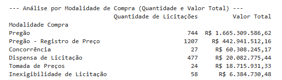
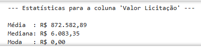
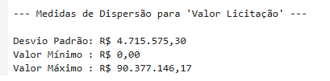
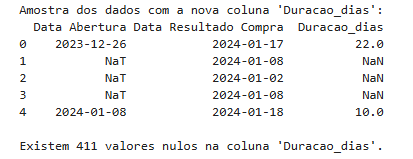
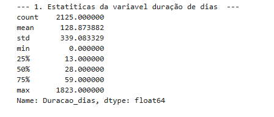
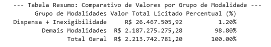

# Título do Projeto: Análise do Uso da Dispensa de Licitação nos Gastos do Governo Federal

**Aluno:**
Igo Costa

## 1. Introdução e Apresentação da Base de Dados

Este trabalho apresenta uma análise descritiva de um conjunto de dados sobre licitações públicas, extraído do Portal da Transparência do Governo Federal. O objetivo é examinar as características centrais dos processos licitatórios a fim de identificar padrões e extrair insights que possam informar a formulação de políticas públicas voltadas para a melhoria da eficiência e da economicidade na gestão de recursos.

Para esta análise, foram selecionadas duas variáveis numéricas principais que capturam dimensões críticas do processo: a dimensão financeira, representada pela variável Valor Licitação, e a dimensão de eficiência temporal, representada pela variável Duracao_dias, que foi calculada a partir da diferença entre a data de resultado e a data de abertura de cada processo.

## 2. Análise Descritiva das Variáveis

### 2.1. Análise da Variável Valor Licitação

A variável Valor Licitação apresentou uma notável assimetria em sua distribuição. A média dos valores foi de R$ 872.582,90, enquanto a mediana foi de apenas R$ 6.083,35. A disparidade substancial entre essas duas medidas de tendência central indica que a maioria dos processos licitatórios envolve valores relativamente baixos, enquanto um número reduzido de licitações com valores extremamente elevados distorce a média para cima. A amplitude dos dados corrobora essa observação, com valores que variam de R$ 0,00 a um máximo de R$ 90.377.150,00.

A alta variabilidade é quantificada pelo desvio-padrão de R$ 4.715.575,06, um valor que supera a própria média. O Coeficiente de Variação (CV) resultante é de aproximadamente 540%, um índice extremamente elevado que confirma a forte heterogeneidade e a concentração de valor em um pequeno subconjunto de contratos.

### 2.2. Análise da Variável Duração dias

A eficiência temporal dos processos foi analisada através da variável Duração dias. O tempo médio para a conclusão de um processo licitatório foi de 129 dias aproximadamente, com uma mediana de 28 dias. Assim como na análise de valores, a diferença entre a média e a mediana sugere que, embora metade dos processos seja concluída em até dois meses, a existência de processos atipicamente longos eleva a média geral. A dispersão, medida pelo desvio-padrão de 339 dias, indica uma falta de padronização nos prazos processuais

## 3. Implicações para Políticas Públicas

As características observadas nos dados levantam importantes discussões sobre a gestão de compras públicas e apontam para possíveis implicações para políticas públicas.

- **Otimização da fiscalização e gestão de risco:** A extrema concentração de valor em poucas licitações sugere uma oportunidade para a otimização da alocação de recursos de fiscalização. Órgãos de controle poderiam adotar uma abordagem baseada em risco, intensificando a auditoria sobre a pequena porcentagem de contratos de alto valor, que representam o maior impacto financeiro, enquanto processos de menor valor poderiam seguir um fluxo de verificação simplificado, aumentando a eficiência geral do sistema.

- **O Papel estratégico das contratações diretas:** A análise revelou que as modalidades de Dispensa e Inexigibilidade de Licitação, embora numericamente expressivas (535 processos), correspondem a apenas 1,2% do montante financeiro total. Este dado valida a política de permitir contratações diretas para aquisições de baixo valor, pois confere agilidade à administração pública em demandas rotineiras sem comprometer grandes volumes de recursos. Contudo, o volume elevado de processos justifica o monitoramento contínuo para mitigar riscos como o fracionamento indevido de despesas.

- **Eficiência e celeridade processual:** A duração dos processos licitatórios serve como um indicador chave de eficiência administrativa. Prazos estendidos, como os observados na cauda longa da distribuição da variável Duracao_dias, implicam em maiores custos de transação para o Estado e para os fornecedores. Políticas públicas focadas na redução desses prazos, como a digitalização completa do fluxo processual, a padronização de editais e a capacitação contínua dos servidores envolvidos, poderiam gerar ganhos significativos de eficiência e economicidade.

## 4. Conclusão

A análise descritiva dos dados de licitações demonstrou ser uma ferramenta poderosa para a geração de insights aplicáveis à gestão pública. Os resultados indicam uma forte assimetria na distribuição de valores, validam o papel das contratações diretas para compras de menor impacto, e apontam a duração dos processos como um ponto crítico para a eficiência administrativa, no entanto nos dados analisados as contratações diretas não superam a regra de licitar, haja vista que correspondem a um percentual de 1,2% em relação ao montante licitado. Sendo assim, a contínua exploração de dados públicos é indispensável para diagnosticar gargalos, aprimorar a transparência e fundamentar políticas que visem uma alocação mais eficiente e eficaz dos recursos públicos.
